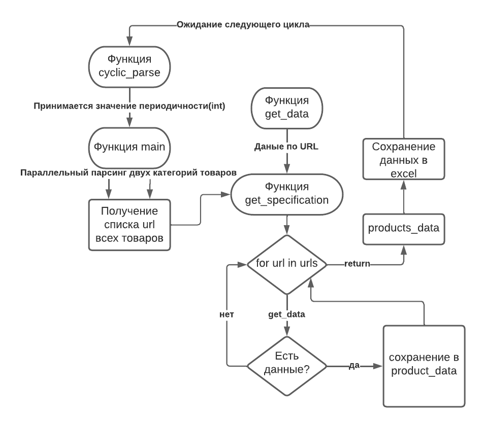

# Парсер сайта qgold.com

Сервис параллельно парсит товары с двух страниц и сохраняет данные каждого
товара в excel файл в директорию output. Парсинг происходит циклично - при запуске
программы необходимо ввести периодичность в целых минутах.

## Установка и запуск


Клонировать репозиторий и перейти в него в командной строке:

```
git clone https://github.com/DoDmAnat/qgold_parser
```

```
cd qgold_parser
```

Cоздать и активировать виртуальное окружение:

```
python -m venv venv
```

```
source venv/bin/activate
```

Установить зависимости из файла requirements.txt:

```
python -m pip install --upgrade pip
```

```
pip install -r requirements.txt
```

Запуск
```
python main.py
```

## Блок-схема
